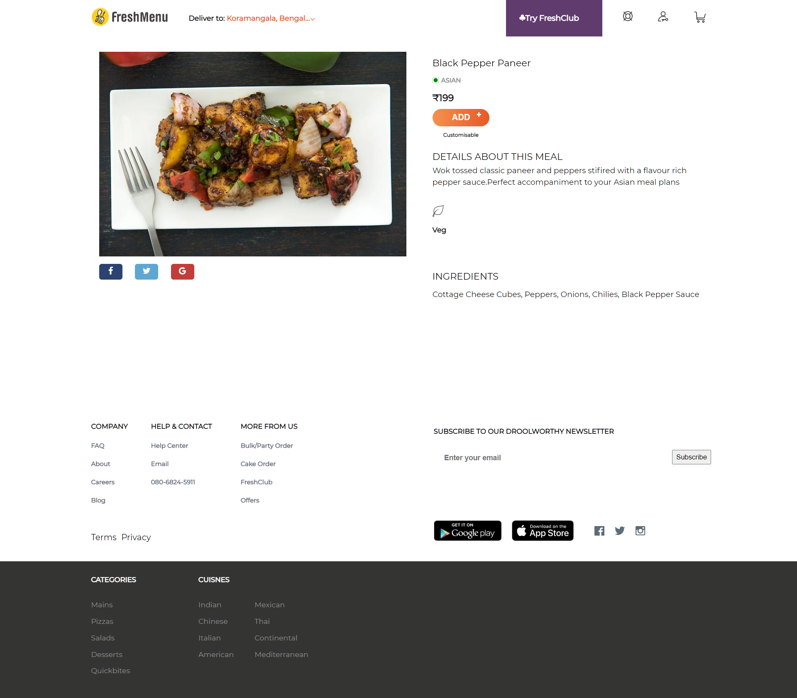
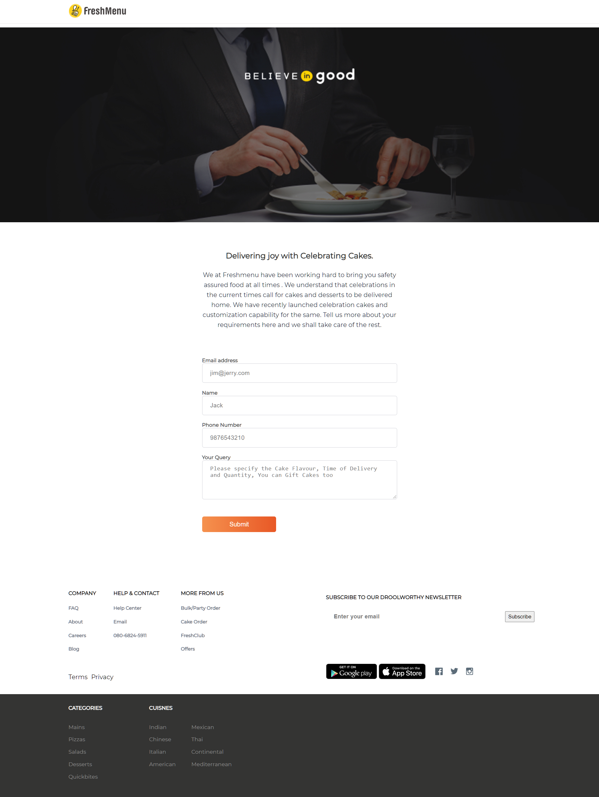

# freshmenu-clone
  
 

  Freshmenu is a online food ordering website with a wide variety of delicious cuisines
  This was my very first project built and the duration of this project was 3 days.
  The tech stacks used were html,css and javascript
 

## Tech Stack used:

<code></code>
<code></code>
<code></code>
<code></code>

## Demo

## <code>Landing Page</code>

## <code>Item Page</code>

## <code>Static Page</code>

## Link
<a href="https://603311b2e88b4e5d863bf65a--fresh-menu.netlify.app/#indianthalis">Live Demo</a>
